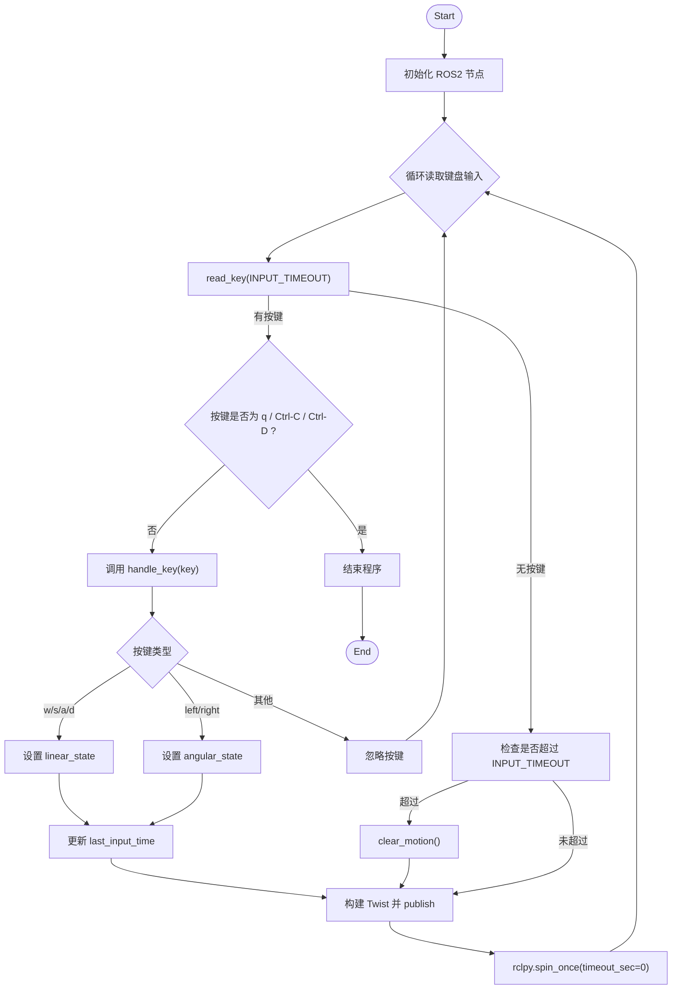

# x3_mobile_control(ROS2版)

### 视频

点击上方封面可播放演示视频

### 程序运行平台

- 硬件：Rosmaster_X3 / Orin开发板
- 系统：jetpack / docker / ROS2
- 功能包、节点：hzt_mcnamu_mobile hzt_keyboard_control
- 程序路径：/root/hzt_ws/src/hzt_mcnamu_mobile/hzt_mcnamu_mobile/hzt_keyboard_control.py

### hzt_keyboard_control.py 代码简介

- 关键类和方法：

    TerminalReader：

        read_key：读取键盘按键
    HztKeyboardNode(Node) ：发布运动信息，控制小车移动

        run：主要流程，循环读取按键，发布运动信息
        handle_key：按键处理
        set_linear_state：设置直线速度
        set_angular_state：设置旋转速度
        clear_motion：刹车停止

### 程序流程图

### 流程说明

- 程序初始化 ROS2 节点 `HztKeyboardNode`
- 通过 `TerminalReader.read_key()` 非阻塞读取键盘输入
- 按键映射为线性/角速度状态，并发布 `geometry_msgs/Twist` 到 `/cmd_vel`
- 若超过超时未按键，则清空运动状态并发布静止指令
- 按 `q` 或 Ctrl-C/Ctrl-D 退出程序

