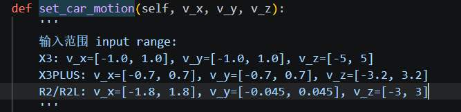

# 功能需求

- 用键盘控制小车移动

- 用ROS2话题通信方式，小车移动信息话题节点/cmd_vel，接口类型为Twist

- 检测键盘按键， 与小车移动信息
  - 直线控制：

    W向前，twist.linear.x = 0.3

    S向后，twist.linear.x = -0.3

    A向左，twist.linear.y = 0.3

    D向右，twist.linear.y = -0.3

  - 转向控制：

    左方向键，左转，twist.angular.z = 2.0

    右方向键，右转，twist.angular.z = -2.0

- 无键盘输入，停止，publish(Twist())

- 附加要求：

  其它按键，不响应

- 以后再做：

  按键互斥

  移动，转向，数值单位确认

