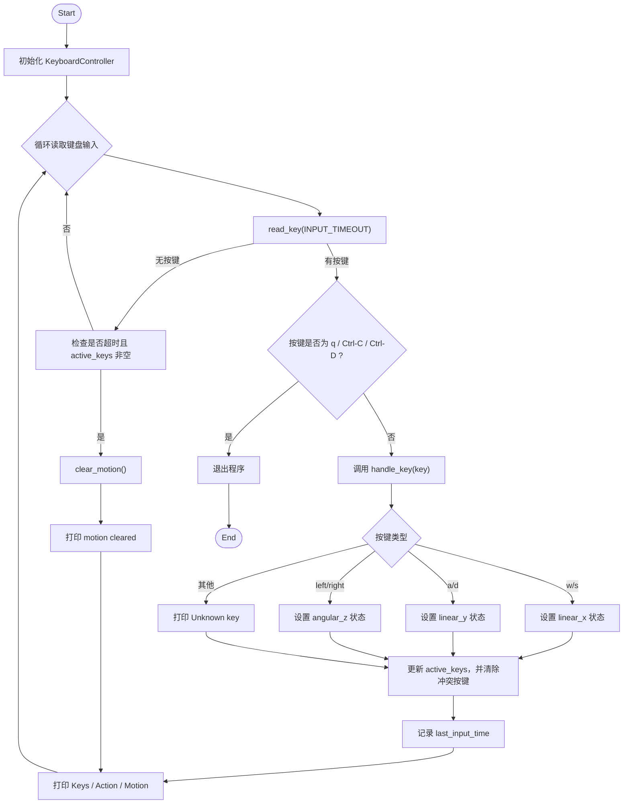

```mermaid
graph TD
    Start([Start]) --> Init[初始化 KeyboardController]
    Init --> Loop{循环读取键盘输入}
    Loop --> ReadKey["read_key(INPUT_TIMEOUT)"]
    ReadKey --> |有按键| CheckQuit{按键是否为 q / Ctrl-C / Ctrl-D ?}
    CheckQuit --> |是| Exit[退出程序]
    CheckQuit --> |否| Handle["调用 handle_key(key)"]
    Handle --> KeyType{按键类型}
    KeyType --> |w/s| LinearX["设置 linear_x 状态"]
    KeyType --> |a/d| LinearY["设置 linear_y 状态"]
    KeyType --> |left/right| AngularZ["设置 angular_z 状态"]
    KeyType --> |其他| Unknown["打印 Unknown key"]
    LinearX --> UpdateActive["更新 active_keys，并清除冲突按键"]
    LinearY --> UpdateActive
    AngularZ --> UpdateActive
    Unknown --> UpdateActive
    UpdateActive --> Timestamp["记录 last_input_time"]
    Timestamp --> PrintStatus["打印 Keys / Action / Motion"]
    PrintStatus --> Loop

    ReadKey --> |无按键| NoKey[检查是否超时且 active_keys 非空]
    NoKey --> |是| Clear["clear_motion()"]
    Clear --> PrintClear[打印 motion cleared]
    PrintClear --> PrintStatus
    NoKey --> |否| Loop

    Exit --> End([End])
```